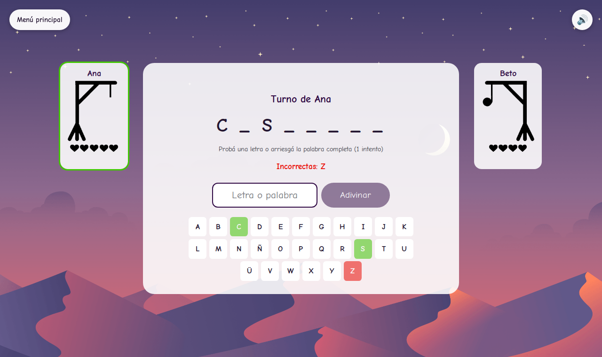

# The Hangman Game

A browser-based 2-player Hangman battle, ported from a Python/Pygame original.

## Preview



## Stack

- TypeScript
- React
- Vite
- Howler.js
- Vitest
- Playwright

## Run locally

```bash
pnpm install
pnpm dev
```

## Tests

```bash
pnpm test        # unit tests
pnpm test:e2e     # end-to-end tests (desktop + mobile)
```

See [`docs/migration-notes.md`](docs/migration-notes.md) for the story behind the port.
