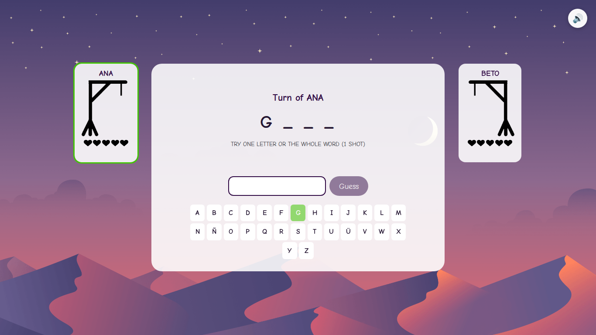

# Hangman Game

A browser-based TypeScript/React remake of a 2-player Hangman game originally
built in Python with Pygame.



## Overview

This isn't the classic single-guesser hangman — it's a local hot-seat **battle**
between two players. On your turn you either guess one letter, or risk a
one-shot guess at the entire word: guess it right and you win the round
instantly; guess it wrong and your opponent wins the round instead. Lives
reset every round; first to 3 round wins takes the match.

The UI text stays in the original's language (mostly English labels, Spanish
word list) — only the codebase, tooling, and documentation were translated for
this migration.

## Origin

Ported from a Python/Pygame project (2-player local Hangman). See
[`docs/migration-notes.md`](docs/migration-notes.md) for a full breakdown of
what changed, what was fixed, and what was intentionally preserved as-is.

## Architecture

- **Domain layer** (`src/domain/`) — framework-agnostic, pure game rules: a
  single `applyAction(state, action, deps) => { state, events }` reducer plus
  small pure helpers (word normalization, guess validation, round state).
  No React, no DOM — this is what makes it unit-testable in isolation.
- **`useGame`** (`src/hooks/useGame.ts`) — bridges the reducer into React
  state and turns the reducer's `events` into sound effects.
- **Components** (`src/components/`) — one component per screen
  (`intro` / `nameEntry` / `battle` / `end`) plus shared UI pieces
  (`PlayerPanel`, `Gallows`, `OnScreenKeyboard`, `MuteButton`). Styled with
  CSS Modules; no CSS framework.
- **Audio** (`src/audio/audioManager.ts`) — a small Howler.js wrapper for
  sound effects and looping music, driven by the reducer's volume state.

## Technologies

| Purpose         | Choice              |
| --------------- | ------------------- |
| Language        | TypeScript (strict) |
| UI              | React 19            |
| Build tool      | Vite                |
| Audio           | Howler.js           |
| Unit tests      | Vitest              |
| E2E tests       | Playwright          |
| Lint / format   | ESLint + Prettier   |
| Package manager | pnpm                |

No game engine (Canvas/PixiJS/Phaser) — the game is screens, text, and sounds,
not sprite-based real-time rendering, so a plain React + CSS UI is the
simplest fit.

## Local development

Requires Node.js 20+ and pnpm.

```bash
pnpm install
pnpm dev
```

Opens at `http://localhost:5173`.

## Available scripts

| Script                              | Description                                          |
| ----------------------------------- | ---------------------------------------------------- |
| `pnpm dev`                          | Start the Vite dev server                            |
| `pnpm build`                        | Type-check and build for production (`dist/`)        |
| `pnpm preview`                      | Serve the production build locally                   |
| `pnpm typecheck`                    | Type-check without emitting                          |
| `pnpm lint`                         | Run ESLint                                           |
| `pnpm format` / `pnpm format:check` | Run / check Prettier                                 |
| `pnpm test`                         | Run unit tests (Vitest)                              |
| `pnpm test:watch`                   | Run unit tests in watch mode                         |
| `pnpm test:e2e`                     | Run E2E tests (Playwright)                           |
| `pnpm generate:words`               | Regenerate `src/data/words.ts` from `data/words.csv` |

## Testing

**Unit tests** (`src/domain/**/__tests__`) cover the game rules in isolation:
word normalization (accents, Ñ/Ü), guess validation, single-letter and
full-word outcomes, win/lose detection, name validation, and full
state-machine scenarios — 53 tests, run with `pnpm test`.

**E2E tests** (`e2e/hangman.spec.ts`) drive the real rendered app with
Playwright: starting the game, name validation, correct/wrong letter guesses
and their effect on lives and hangman artwork, completing a round, losing a
round to an empty life pool, both outcomes of a full-word guess, winning a
full match and restarting, the on-screen keyboard, and the mute toggle — 13
tests, run with `pnpm test:e2e` (auto-starts the dev server).

Since the game deals words at random, E2E tests inject deterministic
word/turn/reveal choices via a `window.__HANGMAN_TEST__` hook set before the
app boots (see `e2e/helpers.ts` and `src/testHooks.ts`) — a no-op for every
real player.

## Production build

```bash
pnpm build
pnpm preview
```

## Project structure

```
data/                   Original word list source (data/words.csv)
docs/                   Migration notes, README screenshot
e2e/                    Playwright end-to-end tests
public/assets/          Migrated images and audio (served as static files)
scripts/                generate-words.ts (words.csv -> src/data/words.ts)
src/
  audio/                Howler.js wrapper
  components/           Screens and shared UI components
  data/                 Generated word list (src/data/words.ts)
  domain/               Pure game rules + unit tests
  hooks/                useGame
  testHooks.ts          E2E determinism hook
```

## Asset notes

Original images and audio were migrated into `public/assets/`, with the
hangman gallows artwork restored (it shipped with the original game but was
never actually used) and audio transcoded to MP3 to cut payload size. Full
details, including what was intentionally left out, are in
[`docs/migration-notes.md`](docs/migration-notes.md#assets).

## Deployment (Vercel)

This is a static Vite app — no backend, no environment variables required.

1. Push this repository to GitHub (already done if you're reading this on
   the hosted repo).
2. In Vercel, **Add New Project** and import the repository.
3. Vercel auto-detects the Vite framework preset (build command
   `pnpm build` / output directory `dist`) — no custom configuration needed.
4. Deploy.

## Notable differences from the original

See [`docs/migration-notes.md`](docs/migration-notes.md) for the full list
with reasoning. In short:

- Fixed an off-by-one bug in random word selection.
- Fixed an inconsistent turn-alternation edge case after losing a round to
  an empty life pool.
- Restored the hangman gallows artwork and the `next_word` sound effect,
  both present in the original's assets but never wired into the game.
- Added a clickable on-screen keyboard (needed for Ñ/Ü, and for touch
  devices) and a mute toggle — both disclosed additions, not in the original.
- Replaced the fixed 975×609 Pygame window with a responsive layout that
  adapts from mobile widths up through 1080p+ desktops.
